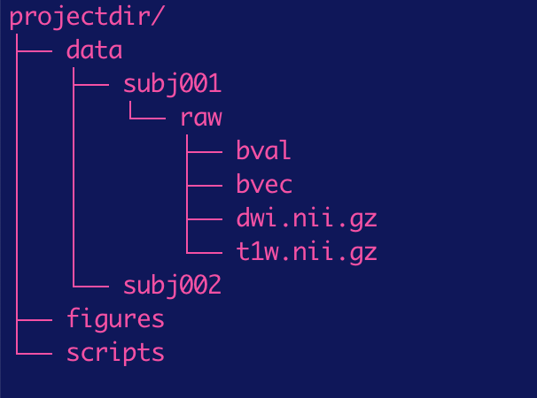

# ConNAcctome processing pipeline 

Brain regions communicate via long-range axonal connections, referred to as "white matter" because they are covered in fatty (myelin) sheaths that allow for faster communication. Diffusion-weighted imaging allows us to quantify some of the structural properties of these connections. This repository describes a pipeline for getting these structural measurements for tracts of interest, starting from raw diffusion-weighted imaging data. 

This pipeline focuses on identifying the **"ConNAcctome"**: white matter tracts in the brain that project to the Nucleus Accumbens (NAcc) from: 1) the dopaminergic midbrain, 2) anterior insula, 3) amygdala, and 4) medial prefrontal cortex. 

This code is based heavily on Josiah's tractography pipeline, which is well-documented here: https://github.com/josiahkl/spantracts

*to do: add Citations for these methods: Leong et al., 2016, 2018; MacNiven et al., 2020*


## Getting started


### Software requirements 

* [Python 2.7](https://www.python.org/)
* [Matlab](https://www.mathworks.com/products/matlab.html)
* [matlab package, VISTASOFT](https://github.com/vistalab/vistasoft) 
* [matlab package, spm (as a VISTASOFT dependency)](https://www.fil.ion.ucl.ac.uk/spm/) 
* [matlab package, AFQ](https://github.com/yeatmanlab/AFQ)
* [mrtrix 3.0](http://www.mrtrix.org/) 
* [freesurfer](https://surfer.nmr.mgh.harvard.edu/) 
* [ANTs (coregistration software)](http://stnava.github.io/ANTs/)

### Directory structure 

Pipeline assumes that the scripts in this repo sit in a "scripts" folder with following directory structure:



Additional project-specific scripts can be housed in the "scripts" directory as well. 

### Permissions

make sure the user has permission to execute scripts. From a terminal command line, cd to the scripts directory. Then type:
```
chmod 777 *sh
chmod 777 *py
```
to be able to execute them. This only needs to be run once. 


### Paths

make sure matlab has access to all the relevant paths for running this pipeline. Before running a matlab script, at the matlab command line, type: 
```
addpath(genpath('path/to/directory/with/matlab/scripts'))

```
where 'path/to/directory/with/matlab/scripts' is, e.g., 'projectdir/scripts'. 


## Pipeline (#pipeline)

- [raw data files and format](#raw-data-files-format)
- [Acpc-align t1 data](#acpc-align-t1-data)
- [Run freesurfer recon](#run-freesurfer-recon)
- [Convert freesurfer files to nifti](#convert-freesurfer-files-to-nifti)
- [Create ROI masks](#create-roi-masks)
- [Pre-process diffusion data](#pre-process-diffusion-data)
- [Mrtrix pre-processing steps](#mrtrix-pre-processing-steps)
- [fiber tractography](#track-fibers)
- [Clean fiber bundles](#clean-fiber-bundles)
- [Visualization](#Visualization)
- [Save out measurements from fiber bundles cores](#save-out-measurements-from-fiber-bundles-cores)
- [Correlate diffusivity measures with behavioral and functional measures](#correlate-diffusivity-measures-with-behavioral-and-functional-measures)
- [Quality Assurance checks](#QA)


### Acpc-align t1 data
In matlab, run:
```
mrAnatAverageAcpcNifti
```
Use GUI to manually acpc-align t1 data 

#### output
Save out acpc-aligned nifti to **projectdir/data/t1/t1_acpc.nii.gz**. 


### Run freesurfer recon
From terminal command line, cd to dir with subject's acpc-aligned t1 and run: 
```
recon-all -i t1_acpc.nii.gz -subjid subjid -all
```
This calls freesurfer's recon command to segment brain tissue

#### output
Saves out a bunch of files to directory, **/usr/local/freesurfer/subjects/subjid**.


### Convert freesurfer files to nifti 
In matlab, run:
```
convertFsSegFiles_script.m
```
To convert freesurfer segmentation files to be in nifti format.

#### output
Saves out converted freesurfer segmentation files to directory, **projectdir/data/subjid/t1**


### Create ROI masks
Its time to create ROI masks that will be used for tractgraphy. To save out ROIs that are based on freesurfer segmentation, in matlab, run:
```
createRoiMasks_script.m
```
To save out desired ROI masks based on FS segmentation labels. For example, save out NAcc, amygdala, and insula ROIs.  


To save out ROI masks that are atlas-based, we need to first estimate the transform that will align a subject's brain to the atlas template. The inverse transform can then be applied to move an atlas ROI to a subject's native space. To do this, from the terminal command line, run: 
```
t12mni_ANTS_script.py
```
and then in matlab, run:
```
xformROIs_script.m
```
We use this pipeline to create a midbrain dopaminergic ROI in each subject's native space that is based on the CIT168 atlas (Pauli et al., 2018) which combines the following labels (all dopaminergic regions): VTA, SNc, and PBP. 


Finally, you can create an ROI sphere that's based on coordinates. For example, to create an 8 mm diameter sphere ROI mask centered on coordinates (+/-4, 45, 4; Leong et al., 2016) in the medial prefrontal cortex, run: 
```
[add mpfc roi script here]
```

#### output
Desired ROI masks are saved out to **projectdir/data/subjid/ROIs** in nifti format. 


At this point, you should have ROI masks that will be used for tractography. **Make sure these look as you expect!!** To check that, load a subject's anatomy (t1.nii.gz) and ROI masks into your viewer of choice (e.g., ITKSnap, MRIcron, afni, FSL's viewer, or mrtrix's viewer, mrview) and confirm that the masks align nicely to the regions you care about. 

### Pre-process diffusion data
In Matlab, run:
```
dtiPreProcess_script
```
To do vistasoft standard pre-processing steps on diffusion data. 

#### output
Saves out files to directory, **projdir/data/subjid/dti96trilin**


